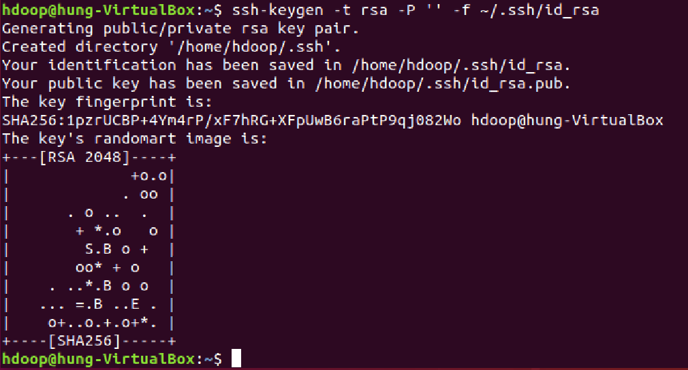
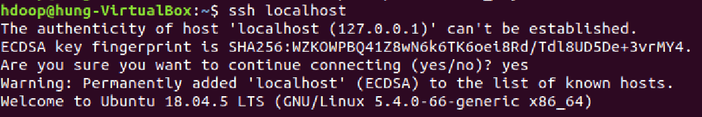
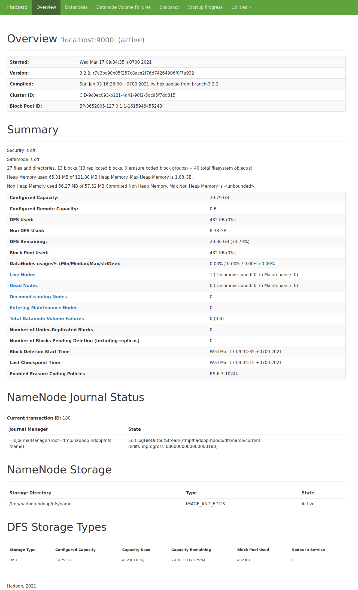
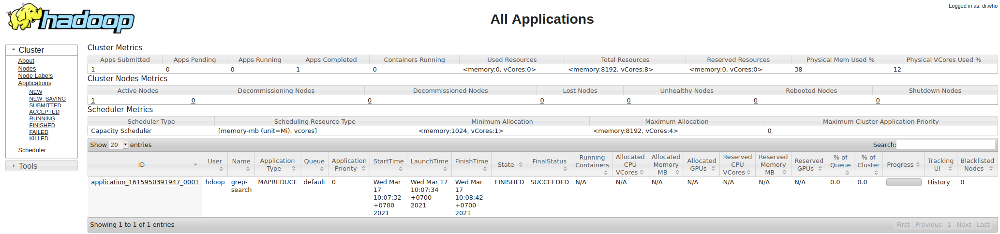

<h1>
 
<center> XỬ LÝ DỮ LIỆU LỚN </center>
</h1>

<h1 style="text-align:center"> Lab 1: Cài đặt Hadoop </h1>

- [Giới thiệu](#intro) <br>
- [Thiết lập môi trường](#create_env) <br>
- [Cài đặt Hadoop](#hadoop_installation) <br>
- [Vận hành Hadoop](#operate_hadoop) <br>
    * [Khởi động Hadoop](#start_hadoop)
    * [Dừng Hadoop](#stop_hadoop)
    * [Truy cập Hadoop qua trình duyệt Web](#hadoopUI)
- [Tham khảo](#references) 

## Giới thiệu <a name="intro" />
[Hadoop](https://hadoop.apache.org/) là nền tảng công nghệ mã nguồn mở dùng để xây dựng hệ thống xử lý dữ liệu lớn (big data) theo mô hình phân tán (distributed computing). Hadoop có độ tin cậy cao (reliable) và khả năng mở rộng dễ dàng (scalable). 

Có thể triển khai hệ thống Hadoop theo một trong ba chế độ (mode) sau:
- Độc lập (Standalone): 
Mọi tiến trình xử lý đều chạy trên một máy ảo Java (JVM) đơn lẻ. Chế độ này phù hợp để chạy các chương trình MapReduce trong quá trình phát triển thử nghiệm.

- Phân tán giả lập (Pseudo-distributed):
NameNode và DataNode cùng chạy trên một máy tính.

- Phân tán hoàn toàn (Fully distributed):
Các tiến trình Hadoop (daemons) chạy trên một cụm nhiều máy tính vật lý.

Bài thực hành này thực hiện cài đặt Hadoop chế độ giả lập phân tán trên môi trường Linux. 

Các phiên bản phần mềm được sử dụng bao gồm:
- Hệ điều hành Ubuntu (https://releases.ubuntu.com/18.04/ubuntu-18.04.5-desktop-amd64.iso). 
Có thể cài đặt Ubuntu trên môi trường máy ảo (Virtual Box, https://download.virtualbox.org/virtualbox/6.1.18/VirtualBox-6.1.18-142142-Win.exe)
- Java 8 (https://www.oracle.com/java/technologies/javase/javase-jdk8-downloads.html)
- Python 3 (Được cài sẵn trên Ubuntu 18.04)
- Hadoop 3.2.2 (https://mirror.downloadvn.com/apache/hadoop/common/hadoop-3.2.2/hadoop-3.2.2.tar.gz)


## Thiết lập môi trường <a name="create_env"/>

### Tạo tài khoản quản trị Hadoop
Để tăng tính bảo mật, nên tạo một tài khoản riêng để quản trị hệ thống Hadoop.
Mở Ubuntu Terminal và nhập lệnh sau:
```shell
sudo adduser hdoop 
```
Trong đó "hdoop" là tên tài khoản mới. Nhập mật khẩu cho tài khoản mới khi được yêu cầu.

### Cấp quyền sudo cho tài khoản
```shell
sudo usermod -aG sudo hdoop
```
### Đăng nhập tài khoản quản trị Hadoop
```shell
su - hdoop
```

#### Cài đặt SSH (Secure Shell Protocol) cho tài khoản Hadoop
Giao thức SSH thường được sử dụng để truy cập đến máy tính từ xa. 
Để cài đặt SSH, thực hiện lệnh sau:

```shell
sudo apt install openssh-server openssh-client -y
```
Để cho phép SSH vào tài khoản Hadoop mà không cần nhập mật khẩu, tạo cặp khóa SSH bằng lệnh sau:

```shell
ssh-keygen -t rsa -P '' -f ~/.ssh/id_rsa
```



Dùng lệnh "cat" để lưu khóa công khai thành khóa ủy quyền (authorized keys) vào thư mục ssh:

```shell
cat ~/.ssh/id_rsa.pub >> ~/.ssh/authorized_keys
```

Thiết lập quyền truy cập đến khóa ssh:

```shell
chmod 0600 ~/.ssh/authorized_keys
```

Kiểm tra việc cài đặt bằng lệnh sau:

```shell
ssh localhost
```
Hệ thống hiện thông báo:
> Are you sure you want to continue connecting (yes/no)?

Nhập "yes".


#### Tắt IPv6 

Một số thiết lập có thể dẫn đến liên kết Hadoop với IPv6 trên Ubuntu. Vì thế nên tắt IPv6.
Thực hiện lệnh sau:
```shell
sudo nano /etc/sysctl.conf
```
và bổ sung các dòng sau vào cuối file:

```shell
# disable IPv6
net.ipv6.conf.all.disable_ipv6 = 1
net.ipv6.conf.default.disable_ipv6 = 1
net.ipv6.conf.lo.disable_ipv6 = 1
```
Lưu lại các thay đổi với file `/etc/sysctl.conf` và khởi động lại Ubuntu.
Kiểm tra trạng thái IPv6 bằng lệnh sau:
```shell
cat /proc/sys/net/ipv6/conf/all/disable_ipv6
```
Nếu kết quả hiện lên là 1 có nghĩa IPv6 đã được tắt (disabled).

#### Cài đặt Java

Hadoop 3.2.x chỉ hỗ trợ Java 8

```shell
sudo apt install openjdk-8-jdk -y
```

## Cài đặt Hadoop <a name="hadoop_installation"/>

### Tải nguồn cài đặt Hadoop:
Phiên bản Hadoop được sử dụng là 3.2.2. Đăng nhập vào tài khoản quản trị Hadoop (ở đây là "hdoop") và tải nguồn cài đặt:

```shell
wget https://mirror.downloadvn.com/apache/hadoop/common/hadoop-3.2.2/hadoop-3.2.2.tar.gz
```
(Hoặc có thể copy nguồn cài Hadoop từ USB hay từ máy tính khác)

Giải nén nguồn cài đặt Hadoop: 

```shell
tar xzf hadoop-3.2.2.tar.gz
```

Toàn bộ các file của Hadoop sẽ được giải nén và lưu trong thư mục `hadoop-3.2.2`

### Thiết lập cấu hình Hadoop:
Cấu hình Hadoop được thiết lập thông qua các file sau: 
- `bashrc`: là file của hệ điều hành, chứa các lệnh được thực thi khi người dùng đăng nhập 
- `hadoop-env.sh`: file thiết lập môi trường của Hadoop 
- `core-site.xml`: file thiết lập các thông số cho Hadoop bao gồm: cổng (port number), dung lượng bộ nhớ cấp phát.
- `hdfs-site.xml`: file thiết lập HDFS 
- `mapred-site-xml`: file thiết lập MapReduce 
- `yarn-site.xml`: file thiết lập YARN

#### Thiết lập các biến môi trường cho Hadoop
Mở file `bashrc`:
```shell
sudo nano ~/.bashrc
```

Bổ sung các dòng sau vào cuối file:

```shell
#Hadoop Related Options
export HADOOP_HOME=/home/hdoop/hadoop-3.2.2
export HADOOP_INSTALL=$HADOOP_HOME
export HADOOP_MAPRED_HOME=$HADOOP_HOME
export HADOOP_COMMON_HOME=$HADOOP_HOME
export HADOOP_HDFS_HOME=$HADOOP_HOME
export YARN_HOME=$HADOOP_HOME
export HADOOP_COMMON_LIB_NATIVE_DIR=$HADOOP_HOME/lib/native
export PATH=$PATH:$HADOOP_HOME/sbin:$HADOOP_HOME/bin
export HADOOP_OPTS="-Djava.library.path=$HADOOP_HOME/lib/native"
```

Nhấn `Ctrl+X`, chọn `Y` để lưu lại những thay đổi và nhấn `Enter` để đóng file `.bashrc`

Thực hiện lệnh sau để áp dụng những thay đổi lên môi trường đang chạy:

```shell
source ~/.bashrc
```

#### Thiết lập cấu hình Hadoop
File `hadoop-env.sh` chứa các thiết lập cho YARN, HDFS, MapReduce.

Mở file `hadoop-env.sh`:

```shell
sudo nano $HADOOP_HOME/etc/hadoop/hadoop-env.sh
```

Bổ sung khai báo đường dẫn đến cài đặt Java:
```shell
export JAVA_HOME=/usr/lib/jvm/java-8-openjdk-amd64
```
----
**Lưu ý:**
Để biết đường dẫn đến cài đặt Java, dùng lệnh sau:
```shell
which javac
```
được kết quả có dạng:
```shell
/usr/bin/javac
```
Sử dụng đường dẫn trên để xác định thư mục OpenJDK:
```shell
readlink -f /usr/bin/javac
```
----
#### Thiết lập cấu hình Hadoop core

Thiết lập thư mục tạm cho Hadoop:
```shell
sudo mkdir -p /app/hadoop/tmp
sudo chown hdoop:hdoop /app/hadoop/tmp
sudo chmod 750 /app/hadoop/tmp
```
Để thiết lập Hadoop chế độ giả lập phân tán (pseudo-distributed mode), cần xác định URL đến máy chủ chính (NameNode) và thư mục để Hadoop sử dụng cho tiến trình map và reduce.

Mở file `core-site.xml`:
```shell
sudo nano $HADOOP_HOME/etc/hadoop/core-site.xml
```

Bổ sung các khai báo sau:
```xml
<configuration>
    <property>
        <name>hadoop.tmp.dir</name>
        <value>/app/hadoop/tmp</value>
    </property>
    <property>
        <name>fs.defaultFS</name>
        <value>hdfs://localhost:9000</value>
    </property>
</configuration>
```


#### Cấu hình HDFS

Mở file `hdfs-site.xml`:
```shell
sudo nano $HADOOP_HOME/etc/hadoop/hdfs-site.xml
```

Bổ sung khai báo sau:
```xml
<configuration>
<property>
<name>dfs.replication</name>
<value>1</value>
</property>
</configuration>
```
#### Cấu hình MapReduce
```shell
sudo nano $HADOOP_HOME/etc/hadoop/mapred-site.xml
```
Bổ sung các thiết lập sau:
```xml
<configuration>
    <property>
        <name>mapreduce.framework.name</name>
        <value>yarn</value>
    </property>
    <property>
        <name>mapreduce.application.classpath</name>
        <value>$HADOOP_MAPRED_HOME/share/hadoop/mapreduce/*:$HADOOP_MAPRED_HOME/share/hadoop/mapreduce/lib/*</value>
    </property>
</configuration>
```

#### Thiết lập YARN
Mở file `yarn-site.xml`:
```shell
sudo nano $HADOOP_HOME/etc/hadoop/yarn-site.xml
```
Bổ sung khai báo sau:
```xml
<configuration>
    <property>
        <name>yarn.nodemanager.aux-services</name>
        <value>mapreduce_shuffle</value>
    </property>
    <property>
        <name>yarn.nodemanager.env-whitelist</name>
        <value>JAVA_HOME,HADOOP_COMMON_HOME,HADOOP_HDFS_HOME,HADOOP_CONF_DIR,CLASSPATH_PREPEND_DISTCACHE,HADOOP_YARN_HOME,HADOOP_MAPRED_HOME</value>
    </property>
</configuration>
```

#### Định dạng HDFS 
Trước khi bắt đầu sử dụng Hadoop, cần định dạng hệ thống quản lý file HDFS.
Thực hiện lệnh sau để định dạng HDFS:
```shell
hdfs namenode -format
```

## Vận hành Hadoop <a name="operate_hadoop"/>
### Khởi động Hadoop <a name="start_hadoop"/>
```shell
start-dfs.sh
start-yarn.sh
```

hoặc khởi động tất cả:
```shell
start-all.sh
```

### Dừng Hadoop <a name="stop_hadoop"/>

```shell
stop-dfs.sh
stop-yarn.sh
```

hoặc dừng tất cả:
```shell
stop-all.sh
```

### Truy cập Hadoop qua trình duyệt Web <a name="hadoopUI"/>
#### Truy cập máy chủ chính (NameNode)
```
http://localhost:9870
```



#### Truy cập YARN
```
http://localhost:8088
```


## Tham khảo <a name="references"/>
[Michael G. Noll, Running Hadoop On Ubuntu Linux (Single-Node Cluster)](https://www.michael-noll.com/tutorials/running-hadoop-on-ubuntu-linux-single-node-cluster/ )

[Apache Hadoop 3.2.2](https://hadoop.apache.org/docs/r3.2.2/)
