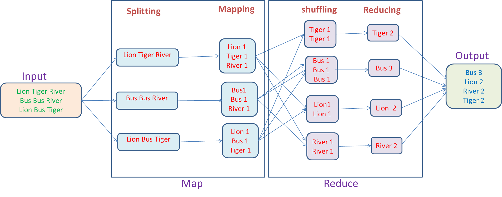
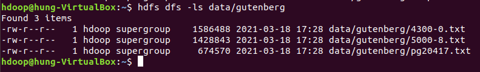
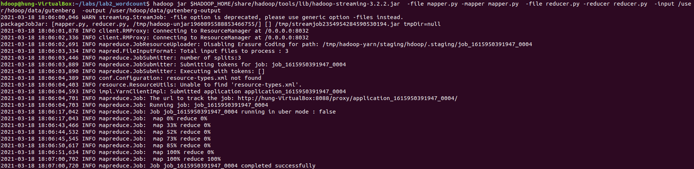
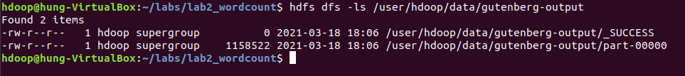
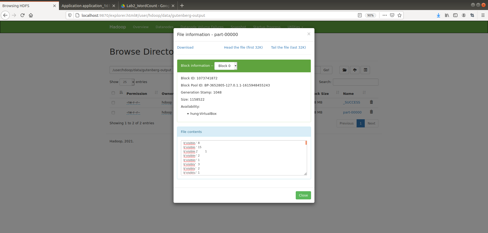
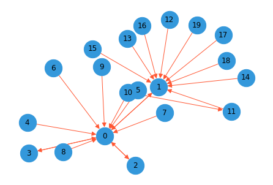

 <br>
<h1 style="text-align:center"> XỬ LÝ DỮ LIỆU LỚN </h1>

<h1 style="text-align:center"> Lab 2: Word Count </h1>

- [Giới thiệu](#intro) <br>
- [Hadoop Streaming](#hadoop_streaming) <br>
- [Chương trình đếm từ](#word_count) <br>
    * [Cách giải quyết thông thường ](#conventional_approach)
    * [Cách giải quyết Big Data ](#bigdata_approach)

- [Chạy ứng dụng trên Hadoop](#run_program) <br>
    * [Khởi động Hadoop](#start_hadoop)
    * [Chuẩn bị dữ liệu](#data_preparation)
    * [Chạy ứng dụng MapReduce](#run_mapreduce_job)
    * [Một số lỗi thường gặp](#common_issues)
- [Bài tập](#excercises)


## Giới thiệu <a name="intro"/>
Bài thực hành này thực hiện đếm số lần xuất hiện của mỗi từ trong một tập dữ liệu văn bản. Chương trình được viết bằng Python và được thực thi thông qua tính năng Hadoop Streaming.

Chương trình Python chạy trên Hadoop MapReduce dựa theo [Michael Noll](https://www.michael-noll.com/tutorials/writing-an-hadoop-mapreduce-program-in-python/), có sửa chữa để tương thích với Python3 và xử lý ký tự UTF-8 từ Hadoop Streaming. Dữ liệu lấy từ dự án thư viện sách miễn phí [Gutenberg](http://www.gutenberg.org), gồm 3 cuốn:
- [The Outline of Science, Vol. 1 (of 4) by J. Arthur Thomson](http://www.gutenberg.org/ebooks/20417.txt.utf-8)
- [The Notebooks of Leonardo Da Vinci](http://www.gutenberg.org/files/5000/5000-8.txt)
- [Ulysses by James Joyce](http://www.gutenberg.org/files/4300/4300-0.txt)

## Hadoop Streaming <a name="hadoop_streaming"/>

Hadoop cung cấp tính năng streaming cho phép tạo và thực thi ứng dụng MapReduce với các ngôn ngữ lập trình khác Java, chẳng hạn như Python hay Ruby. Các chương trình xử lý ở pha Map và Reduce đọc dữ liệu từ thiết bị nhập chuẩn (stdin) và đưa kết quả xử lý ra thiết bị xuất chuẩn (stdout). Hadoop tạo tác vụ MapReduce, gửi tới hệ thống yêu cầu thực thi và giám sát tác vụ cho đến khi hoàn tất.

## Chương trình đếm từ <a name="word_count"/>
### Cách giải quyết thông thường <a name="conventional_approach"/>
Cho một tập dữ liệu văn bản gồm nhiều file chứa trong một thư mục. Chương trình Python sau đây thực hiện mở lần lượt từng file và đếm số lần xuất hiện của mỗi từ.


```python
import os

# Xác định thư mục chứa dữ liệu:
data_foder = "data/gutenberg"

# Khởi tạo từ điển: 
word_counts = {}

# Mở lần lượt các file văn bản trong thư mục dữ liệu để đếm từ:
for fname in os.listdir(data_foder):
    if fname.endswith(".txt"):
        try:
            f = open(os.path.join(data_foder, fname))
            for line in f.readlines():
                for word in line.split():
                    if word in word_counts:
                        word_counts[word] += 1
                    else:
                        word_counts[word] = 1
            f.close()
        except:
            pass

# In ra 10 từ đầu tiên và số lần xuất hiện tương ứng:
print('{:15}{:10}'.format('Từ', 'Tần số'))
print('-------------------------')

for w in list(word_counts)[0:10]:
    print ('{:15}{:10}'.format(w, word_counts[w])) 
```

    Từ             Tần số    
    -------------------------
    The                  2448
    Project               106
    Gutenberg              40
    EBook                   3
    of                  15813
    Notebooks               4
    Leonardo              357
    Da                      7
    Vinci,                 24
    Complete                2
    

Chương trình trên xử lý tuần tự trên một máy đơn. Với tập dữ liệu rất lớn thì việc xử lý sẽ mất nhiều thời gian. <br>
Một cách giải quyết là sử dụng Hadoop để thực hiện xử lý phân tán.  

## Giải pháp Big Data: Hadoop <a name="bigdata_approach"/>

Nền tảng Hadoop cho phép triển khai các ứng dụng xử lý dữ liệu lớn (hàng TB) song song trên các cụm (cluster) lên đến hàng ngàn máy tính với độ tin cậy và khả năng chịu lỗi cao.
### Luồng xử lý của Hadoop MapReduce
Mô hình MapReduce chia tác vụ xử lý thành 2 pha: map và reduce. Với mỗi pha xử lý cần có 1 chương trình tương ứng: mapper và reducer. Cần phải lập trình mapper và reducer để xử lý theo yêu cầu bài toán.
#### Map
Khi bắt đầu xử lý, dữ liệu vào sẽ được chia nhỏ thành nhiều phần, mỗi phần được gửi đến một máy trạm riêng biệt. Mỗi máy trạm thực thi chương trình mapper trên phần dữ liệu nhận được.
Chương trình mapper đọc dữ liệu vào và chuyển thành các cặp <key, value>.
Giá trị của <key, value> do người lập trình xác định tùy theo yêu cầu bài toán. 
Ví dụ, với bài toán đếm từ, cặp <key, value> là <word, count>. Với mỗi từ đọc được, chương trình mapper xuất ra cặp giá trị <word, 1>. Các cặp <word, 1> sẽ được gộp và nhóm lại, những cặp <word, 1> giống nhau sẽ được nhóm lại và gửi đến một máy trạm riêng lẻ để xử lý ở pha reduce.
<br>
#### Reduce
Chương trình reducer xử lý các cặp <key, value> và rút gọn chúng theo cách mong muốn. 
Ví dụ, để đếm số lần xuất hiện của mỗi từ, chương trình reducer sẽ cộng giá trị của tất cả các cặp <word, 1> trùng nhau.

<p align="center">

<center><caption>Minh họa giải quyết bài toán đếm từ với MapReduce</caption></center>
</p>


```python
#!/usr/bin/python3
"""mapper.py"""

import sys

# Chương trình Python chạy trên Hadoop MapReduce qua tính năng Streaming. 
# Dữ liệu vào từ thiết bị nhập chuẩn (STDIN)
# Kết quả xử lý gửi ra thiết bị xuất chuẩn (STDOUT)

for line in sys.stdin.buffer.raw:
    # loại bỏ ký tự trắng ở đầu và cuối chuỗi 
    line = line.strip()
    # tách ra thành các từ
    words = line.split()
    # đưa ra thiết bị xuất chuẩn các cặp <word, 1>, cách nhau bằng ký tự tab
    for word in words:
        print('%s\t%s' % (word, 1))
```


```python
#!/usr/bin/python3
"""reducer.py"""

import sys

current_word = None
current_count = 0
word = None

# lấy dữ liệu từ thiết bị nhập chuẩn
for line in sys.stdin:
    # loại bỏ ký tự trắng ở đầu và cuối chuỗi 
    line = line.strip()

    # tách ra thành cặp <word, 1> (Chú ý: Ở file reduce.py cặp <word, 1> xuất ra với ký tự phân cách tab)
    word, count = line.split('\t', 1)

    # chuyển giá trị count thành kiểu số
    try:
        count = int(count)
    except ValueError:
        # nếu không phải giá trị số thì bỏ qua
        continue

    # Ở cuối pha Map, các cặp (key, value) đã được sắp xếp theo key (ở đây là các từ).
    # Vì vậy ở pha Reduce, chương trình sẽ cộng giá trị value của dãy liên tiếp các từ trùng nhau
    # cho đến khi gặp từ mới.
    if word == current_word: # nếu từ mới trùng với từ đang xét thì tăng giá trị đếm của từ đang xét
        current_count += count
    else: 
        if current_word: # nếu gặp từ mới thì in ra số lần xuất hiện của từ đang xét
            print('%s\t%s' % (current_word, current_count))
        # sau đó chuyển sang xử lý từ mới
        current_count = count
        current_word = word

# in ra từ cuối cùng 
if current_word == word:
    print('%s\t%s' % (current_word, current_count))
```
    

## Chạy ứng dụng Hadoop MapReduce
### Khởi động Hadoop
Thực hiện lệnh sau:
```shell
start-all.sh
```

### Đưa dữ liệu lên HDFS 
Trước khi chạy chương trình MapReduce, cần đưa dữ liệu xử lý lên HDFS.

#### Tạo thư mục chứa dữ liệu trên HDFS
```shell
hdfs dfs -mkdir -p data
```
Hệ thống tạo thư mục `/user/hdoop/data` trên HDFS.
#### Đưa dữ liệu từ máy cục bộ lên HDFS
Giả sử thư mục chứa dữ liệu đầu vào là `/home/hung/Downloads/gutenberg` chứa các files văn bản.
Thực hiện lệnh sau để copy dữ liệu lên HDFS:
```shell
hdfs dfs -copyFromLocal /home/hung/Downloads/gutenberg /user/hdoop/data
```
Kiểm tra việc sao chép:
```shell
hdfs dfs -ls /user/hdoop/data/gutenberg
```


#### Chạy chương trình MapReduce
Giả sử 2 file `mapper.py` và `reducer.py` lưu ở thư mục `/home/hdoop/labs/lab2_wordcount`.

- Chuyển dấu nhắc đến thư mục `lab2_wordcount`:
```shel
cd /home/hdoop/labs/lab2_wordcount
```
- Gọi chương trình MapReduce thông qua Hadoop Streaming:
```shell
hadoop jar $HADOOP_HOME/share/hadoop/tools/lib/hadoop-streaming-3.2.2.jar \
 -file mapper.py -mapper mapper.py \
 -file reducer.py -reducer reducer.py \
 -input /user/hdoop/data/gutenberg \
 -output /user/hdoop/data/gutenberg-output 
```



- Kiểm tra kết quả xử lý:
```shell
hdfs dfs -ls /user/hdoop/data/gutenberg-output
```


Xem nội dung file kết quả:
```shell
hdfs dfs -cat /user/hdoop/data/gutenberg-output/part-00000
```
Hoặc xem qua Hadoop UI:


### Một số lỗi thường gặp <a name="common_issues"/>
- Java exception: Connection refused

Nguyên nhân thường gặp của lỗi này là Hadoop không hoạt động. 

Cách khắc phục:

1. Dừng Hadoop:
```shell
stop-all.sh
```

2. Định dạng lại HDFS:

```shell
hadoop namenode -format
```

3. Khởi động lại Hadoop:

```shell
start-all.sh
```

## Bài tập <a name="excercises"/>

### Bài 1: Xử lý văn bản

Thực hiện các xử lý sau trên tập dữ liệu văn bản `Gutenberg`:
- Sắp xếp bảng từ theo thứ tự giảm dần của số lần xuất hiện và lưu vào file văn bản, mỗi cặp (từ, tần số) trên một dòng.
- Liệt kê 20 từ xuất hiện nhiều nhất.

### Bài 2: Phân tích mạng xã hội 
Cho file văn bản `data/twitter_following.txt` chứa thông tin về việc tài khoản người dùng theo dõi tài khoản khác trên cùng mạng xã hội.
Mỗi dòng file văn bản có dạng:
```code
<user_id1> <user_id2>
```
cho biết người dùng với `user_id1` theo dõi người dùng `user_id2`. Nếu `user_id2` cũng theo dõi `user_id1` thì cặp tài khoản này được gọi là theo dõi lẫn nhau (mutual followers).

Yêu cầu: Vận dụng cả 2 phương pháp (1) truyền thống và (2) dữ liệu lớn thực hiện các xử lý sau:
- Thống kê số lượng người theo dõi (followers) của mỗi tài khoản người dùng.
- Liệt kê top 5 người dùng có nhiều theo dõi nhất.
- Liệt kê tất cả các cặp người dùng theo dõi lẫn nhau trong file dữ liệu được cho. 

**Hướng dẫn:**

Có thể biểu diễn việc theo dõi nhau của các tài khoản Twitter bằng một đồ thị có hướng (directed graph). "`a` theo dõi `b`" tương ứng với tồn tại cạnh (edge) nối từ đỉnh (node) a đến đỉnh b của đồ thị. 

Có thể sử dụng thư viện [NetworkX](https://networkx.org) để biểu diễn đồ thị trên. Đoạn code sau đây minh họa đọc dữ liệu từ file `data/twitter_following.txt`, tạo đồ thị thể hiện mối quan hệ theo dõi, tìm và liệt kê các cặp tài khoản theo dõi lẫn nhau (mutual followers):

```python
import networkx as nx
import matplotlib.pyplot as plt

edges = []

f = open('data/twitter_following.txt', 'r')

for line in f.readlines():
    id1, id2 = line.strip().split()
    edges.append((id1,id2))

# create directed graph from edge pairs using NetworkX Library
G = nx.DiGraph(edges)

# visualize the graph
nx.draw(G, with_labels=True, arrows=True, arrowstyle='-|>', arrow_size=3,
        node_color='#3498DB', node_size=800, 
        edge_color='#FF5733')

plt.show()
```


```python

mutual_followers = []

for u, v in G.edges():
    if G.has_edge(u,v) and G.has_edge(v,u):
        if (v, u) not in mutual_followers:
            mutual_followers.append((u, v))

# List mutual follower pairs:
print('Các cặp tài khoản theo dõi lẫn nhau:')
for u, v in mutual_followers:
    print(u, '<->', v)

```

    Các cặp tài khoản theo dõi lẫn nhau:
    0 <-> 1
    0 <-> 2
    0 <-> 3

### Bài 3: Xử lý dữ liệu Twitter
Cho file văn bản `data/elonmusk_tweets.csv` chứa các dòng tweets của [Elon Musk](https://en.wikipedia.org/wiki/Elon_Musk) từ 2011-2017.
Dữ liệu được chia sẻ bởi [Adam Helsinger](https://data.world/adamhelsinger/elon-musk-tweets-until-4-6-17).
Từ file dữ liệu trên, hãy thực hiện các xử lý sau:
- Liệt kê top 20 từ được nhắc đến nhiều nhất.
- Liệt kê top 10 tài khoản được nhắc đến nhiều nhất.
- Hãy xác định thời điểm trong ngày (0-24 giờ) Elon đăng bài nhiều nhất.

