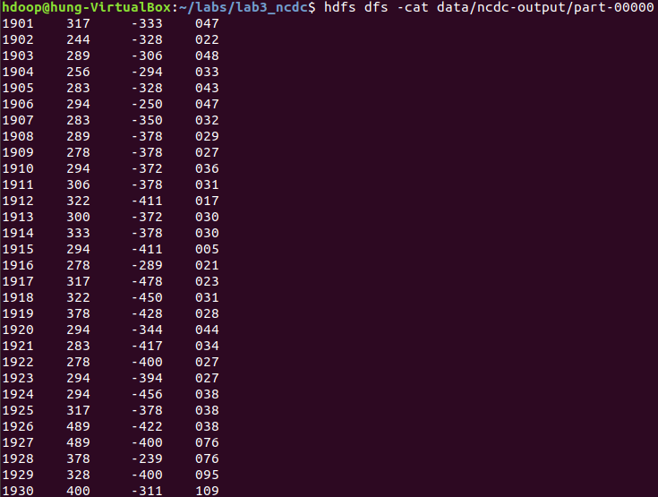
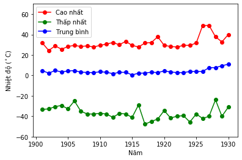

<h1 style="text-align:center">
  XỬ LÝ DỮ LIỆU LỚN </h1>

<h1 style="text-align:center"> Lab 3: Phân tích dữ liệu thời tiết </h1>

- [Giới thiệu](#intro) <br>

- [Chương trình MapReduce ](#mapreduceprogram) <br>

- [Chạy ứng dụng trên Hadoop](#run_program) <br>
- [Bài tập](#excercises)


## Giới thiệu <a name="intro"/>

Bài thực hành này xử lý dữ liệu thu thập bởi [Trung tâm dữ liệu thời tiết Hoa Kỳ](https://www.ncdc.noaa.gov/) (NCDC). Dữ liệu được thu nhận từ các trạm quan trắc được đặt ở nhiều nơi, cung cấp các số đo về khí tượng, bao gồm: ngày, giờ, tọa độ, độ cao, nhiệt độ, áp suất không khí, hướng gió. <br>

[Download dữ liệu đầy đủ](https://github.com/nd-hung/Big-Data/blob/main/Lab3_NCDC_WeatherData/Collect_Data.ipynb) <br>
[Tiền xử lý dữ liệu](https://github.com/nd-hung/Big-Data/blob/main/Lab3_NCDC_WeatherData/Preprocess_Data.ipynb)

**Yêu cầu**: Từ tập dữ liệu thu thập được, hãy tìm nhiệt độ cao nhất của mỗi năm.

|  |
|:--:|
| Diễn giải một mẫu dữ liệu khí tượng từ NCDC. Trong thực tế mỗi bản ghi nằm trên một dòng, các trường dữ liệu liên tiếp nhau (không có ký tự phân cách). Nguồn: *Tom White, Hadoop: The Definitive Guide, 4th Ed., O'Reilly, 2015.* |

## Chương trình MapReduce  <a name = "mapreduceprogram"/>

### Map
MapReduce xem dữ liệu vào dưới dạng các cặp <k1,v1>. Trong trường hợp này `k1` là thứ tự dòng văn bản, `v1` là chuỗi ký tự chứa 1 bản ghi dữ liệu thời tiết.
Chương trình `mapper` đọc từng dòng ký tự từ stdin, lấy ra các giá trị: năm, nhiệt độ và đưa ra stdout dưới dạng <k2,v2> = <year,temperature>.
Các cặp <k2,v2> sẽ được gộp theo `k2` - tức theo năm - trước khi gửi đến pha Reduce.


```python
#!/usr/bin/python3
'''mapper.py'''

import re
import sys

# <k1, v1> = <line, text>
for line in sys.stdin:
  val = line.strip()
  (year, temp, q) = (val[15:19], val[87:92], val[92:93])
  # Kiểm tra tính hợp lệ của dữ liệu 
  if (temp != "+9999" and re.match("[01459]", q)):
    print("%s\t%s" % (year, temp)) # <k2, v2> = <year, temperature>
```

### Reduce
Chương trình reducer đọc từng dòng từ `stdin`, lấy ra từng cặp <k2, v2> = <year, temperature>. Với mỗi giá trị của `k2`, chương trình sẽ tìm giá trị lớn nhất của `v2` và đưa ra `stdout`.


```python
#!/usr/bin/python3
'''reducer.py'''

import sys

# Khởi tạo giá trị năm, nhiệt độ
(last_year, max_temp) = (None, -sys.maxsize)
for line in sys.stdin:
  # Lấy cặp giá trị <k, v> = <year, temp> từ stdin
  (year, temp) = line.strip().split("\t")
  # Nếu năm đọc vào khác năm đang xét -> (1) đưa ra stdout năm trước đó cùng với nhiệt độ cao nhất
  if last_year != None and last_year != year:
    print("%s\t%s" % (last_year, max_temp))
    # và (2) chuyển <năm, nhiệt độ> đọc vào thành <năm, nhiệt độ> đang xét:
    (last_year, max_temp) = (year, int(temp))
  else:
    # Nếu năm đọc vào trùng với năm đang xét -> tìm nhiệt độ lớn nhất của năm đó:
    (last_year, max_temp) = (year, max(max_temp, int(temp)))

# In ra kết quả cho năm cuối cùng:
if last_year:
  print("%s\t%s" % (last_year, max_temp))
```

## Chạy ứng dụng Hadoop MapReduce <a name="run_program"/>

### Khởi động Hadoop
Thực hiện lệnh sau:
```shell
start-all.sh
```

### Đưa dữ liệu lên HDFS 
Trước khi chạy chương trình MapReduce, cần đưa dữ liệu xử lý lên HDFS.

#### Tạo thư mục chứa dữ liệu trên HDFS
```shell
hdfs dfs -mkdir -p data/lab3
```
Hệ thống tạo thư mục `/user/hdoop/data/lab3` trên HDFS.
#### Đưa dữ liệu từ máy cục bộ lên HDFS
Giả sử thư mục chứa dữ liệu đầu vào là `/home/hung/Downloads/ncdc` chứa các files dữ liệu thời tiết của NCDC đã được tiền xử lý gộp theo từng năm.
Thực hiện lệnh sau để copy dữ liệu lên HDFS:
```shell
hdfs dfs -copyFromLocal /home/hung/Downloads/ncdc /user/hdoop/data/lab3
```

#### Chạy chương trình MapReduce
Giả sử 2 file `mapper.py` và `reducer.py` lưu ở thư mục `/home/hdoop/labs/lab3`.

- Chuyển dấu nhắc đến thư mục `lab3`:
```shel
cd /home/hdoop/labs/lab3
```
- Chạy ứng dụng MapReduce thông qua Hadoop Streaming:
```shell
hadoop jar $HADOOP_HOME/share/hadoop/tools/lib/hadoop-streaming-3.2.2.jar \
 -file mapper.py -mapper mapper.py \
 -file reducer.py -reducer reducer.py \
 -input /user/hdoop/data/lab3/ncdc \
 -output /user/hdoop/data/lab3/ncdc-output 
```

- Kiểm tra kết quả xử lý:
```shell
hdfs dfs -ls /user/hdoop/data/lab3/ncdc-output 
```

Copy kết quả xử lý từ HDFS xuống ổ đĩa cục bộ:
```shell
hdfs dfs -copyToLocal /user/hdoop/data/lab3/ncdc-output/part-00000 .
```

### Vẽ biểu đồ kết quả xử lý


```python
import pandas as pd 
import matplotlib.pyplot as plt

# Đọc dữ liệu kết quả
max_temps = pd.read_csv('output/part-00000', delimiter='\t', header=None, names=['year', 'temp'])
# Vẽ biểu đồ 
plt.plot(max_temps['year'], max_temps['temp'] /10, marker="o")
plt.title('Nhiệt độ cao nhất ghi nhận được theo từng năm ')
plt.xlabel('Năm')
plt.ylabel('Nhiệt độ ($^\circ$C)')

plt.show()
```


## Bài tập <a name="excercises"/>


Từ dữ liệu NCDC đã cho, thực hiện các yêu cầu sau:
- Tìm nhiệt độ thấp nhất của mỗi năm.
- Tính nhiệt độ trung bình của mỗi năm.
### Kết quả xử lý 
<year, max * 10, min * 10, avg * 10>



### Hiển thị dưới dạng biểu đồ


Hướng dẫn:  Cho [file dữ liệu mẫu](data/sample_input.txt) chứa các dòng dạng <năm, nhiệt độ> được nhóm theo từng năm. Đoạn code Python sau đọc file, tính và in ra nhiệt độ trung bình theo năm. Dựa theo code này hãy viết chương trình ở pha Reduce để tạo ứng dụng MapReduce tính nhiệt độ trung bình từng năm trên tập dữ liệu NCDC.

```python
f = open('data/sample_input.txt', 'r')

(current_year, current_temp) = (None, None)

count = 0
total = 0

for line in f.readlines():
    year, temp = line.strip().split('\t')
    if (current_year != None) and (current_year != year):
        # Nhiệt độ trung bình được làm tròn đến 1 chữ số phần thập phân và nhân 10
        print('%s\t%s' % (current_year, int(round(total / count, 1) * 10)))
        (current_year, current_temp) = (year, int(temp))
        total = current_temp
        count = 1
    else:
        (current_year, current_temp) = (year, int(temp))
        total += current_temp
        count += 1
        
if current_year:
    print('%s\t%s' % (current_year, int(round(total / count, 1) * 10)))
```

    1901	345
    1902	310
    1903	362
    1904	347
    1905	329
    

- Tìm thời gian (ngày, giờ), tọa độ (latitude, longtitude) tương ứng với nhiệt độ cao nhất mỗi năm. <br>
Hướng dẫn: Cho s là một dòng dữ liệu NCDC, tọa độ được tính như sau bằng Python:

```python 
(latitude, longitude) = (int(s[28:34])/1000,int(s[34:41])/1000)
```

- Tìm địa danh tương ứng với nhiệt độ cao nhất mỗi năm.<br>
Hướng dẫn:
Có thể sử dụng package `reverse_geocoder` để tra địa danh dựa theo tọa độ.

Cài đặt package `reverse_geocoder`:
```shell
pip install reverse_geocoder
```
Sau đó tra địa danh dựa theo đoạn code sau:


```python
# Find location name given (latitude, longitude)

import reverse_geocoder as rg
import pprint
  
def Geocode2Location(coordinates):
    location = rg.search(coordinates)
    return location

f = open('data/preprocessed/1901.txt', 'r')

# Minh họa với 1 dòng dữ liệu
line = f.readline()

lat = int(line[28:34])/1000
lon = int(line[34:41])/1000

geoCode = (lat, lon)
result = Geocode2Location(geoCode)[0]

# Use pretty printer to display result
pprint.pprint(result)

print("\nĐịa điểm quan trắc: ", result['name'] + ', ' + result['cc'])
```

    OrderedDict([('lat', '64.02472'),
                  ('lon', '23.50482'),
                  ('name', 'Lohtaja'),
                  ('admin1', 'Central Ostrobothnia'),
                  ('admin2', 'Kokkola'),
                  ('cc', 'FI')])
    
    Địa điểm quan trắc:  Lohtaja, FI

[Xem biểu đồ kết quả tổng hợp](https://nd-hung.github.io/Big-Data/Lab3_NCDC_WeatherData/docs/ncdc_result_visualization_with_tooltips.html)

